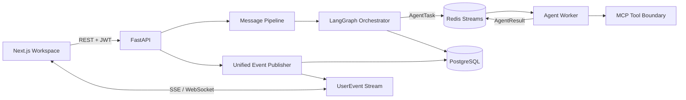

<div align="center">

# Haole

### Durable Multi-Agent Professional Workspace

**A group-chat workspace where agents, skills, MCP tools, human approvals and durable event delivery operate behind explicit task contracts.**

`LangGraph` · `FastAPI` · `Next.js` · `MCP` · `Redis Streams` · `PostgreSQL` · `SSE / WebSocket`

[Full Technical README](../README.md) · [Getting Started](../GETTING_STARTED.md) · [Production Notes](../deploy/production/README.md) · [Migration Evidence](../docs/migration/FINAL_VALIDATION_REPORT.md)

</div>

---

## Why this project matters

Haole is not positioned as another generic “chat with many agents” demo. Its engineering focus is the **runtime underneath professional agent collaboration**: explicit task/result contracts, durable user events, skills, MCP boundaries, human-in-the-loop control and reconnectable delivery.

The interaction model is group chat, while the backend keeps orchestration and execution separate from the UI.

## Core Runtime



## Evidence — what is actually implemented

| Capability | Current implementation |
|---|---|
| Agent interaction | main chat, group chat, single-agent chat, `@Agent`, Plan / Ask / Auto modes |
| Orchestration | one LangGraph orchestration backbone with `AgentTask` / `AgentResult` contracts |
| Worker transport | Redis Streams task bus |
| Tools | MCP service boundary |
| Skills | YAML validation, matching, metadata, install / enable / disable lifecycle |
| Human control | HITL, task steps, artifact and agent-state presentation |
| Durable events | PostgreSQL persistence + Redis Pub/Sub + process fallback |
| Reconnection | stable event IDs, `Last-Event-ID`, deduplication and SSE replay |
| API contracts | OpenAPI-generated TypeScript types + contract drift checks |
| Quality | backend tests, agent tests, frontend tests, Playwright, CI and security checks |

## Professional Workflow Example

The repository includes an e-commerce collaboration workflow implemented inside the same workspace rather than as a separate hard-coded application:

```text
User request
   ↓
Executive Assistant — clarify / coordinate delivery
   ↓
Copy Agent — Chinese product copy
   ↓
Image Agent — product imagery
   ↓
Composition Agent — deterministic Pillow assembly
   ↓
User confirmation before paid image generation
```

Real image-generation calls require explicit credentials and user confirmation. Missing provider credentials cause an explicit failure; the production path does **not** silently fabricate an image or switch providers.

## Runtime Modes & Trust Boundary

The default repository supports a credential-free `LITELLM_MOCK=true` development/test mode. Real model, SMS, object-storage and publishing integrations require server-side credentials.

This distinction is deliberate:

- mock paths are explicit;
- production/staging do not silently fall back to frontend mock data;
- secrets are server-side only;
- durable SSE replay depends on PostgreSQL;
- real long-chain media smoke tests remain opt-in rather than being represented as always-on CI coverage.

## Quick Start

Requirements: **Python 3.12**, **uv 0.11.x**, **Node 20+**, **pnpm 9.15.9**, Docker Compose.

```powershell
.\scripts\core.ps1 setup
.\scripts\core.ps1 start
.\scripts\core.ps1 status
```

The local core path runs the real JWT / FastAPI / PostgreSQL / Redis / Agent flow while enabling an explicit development guest session.

For environment variables, production integrations, database migrations, event contracts and the complete CI matrix, continue to the **[full README](../README.md)**.

---

<div align="center">

**Task contracts · durable events · skills · tools · HITL · recovery**

</div>
