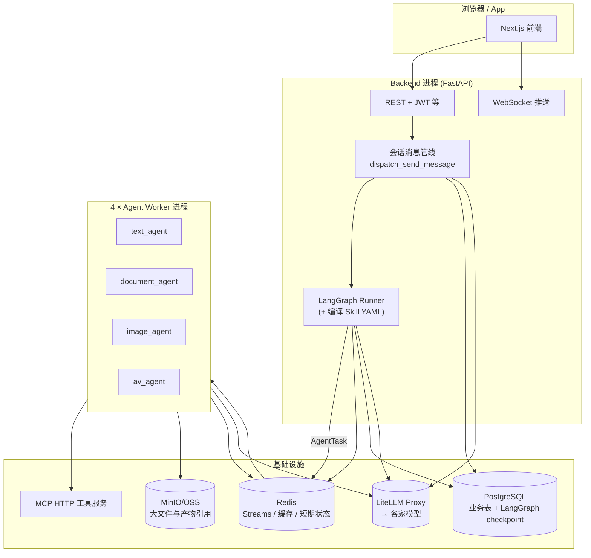

# youle_mas

**有了（Youle）多智能体系统（MAS）** — 以 **主编排（LangGraph）+ Skill 契约（YAML）** 为核心，FastAPI 承载 API/WebSocket，四个领域 Agent worker 消费 Redis 任务流，工具经 **MCP** 暴露；默认可 **零 API Key** 用 LiteLLM mock 跑通全链路。

| 指标 | 说明 |
|------|------|
| Python | 3.12+，`uv` 管理依赖 |
| 主编排进程 | 跑在 **backend** 内，`PYTHONPATH` 需包含 **`agents`** 包（见下文） |
| Agent worker | **4** 进程：文字 / 文档 / 图文 / 影音（`*_agent.main`，与 **`Procfile`** 一致） |
| MCP | **7** 个独立服务（检索、图、音视频、文档、OSS、分发等） |
| 前端 | Next.js 15（`frontend/youle_mas_frontend-main/`），`pnpm` |

**篇幅较长时的阅读顺序：** [仓库布局](#仓库布局) → [架构摘要](#架构摘要) → [前后端工程视角](#fe-be-guide) → [Agents 九维度](#agents-模块能力剖面代码对照) → [快速开始](#快速开始最短) · 其余见文末 [文档索引](#文档索引)。

---

## 仓库布局

```
.
├── backend/           # FastAPI、会话/任务 API、Skill 加载、Alembic、compose、测试
├── agents/
│   ├── agents/        # 可导入包名 `agents`：orchestrator_agent、*_agent、_common
│   └── mcp_servers/   # 7 个 MCP 服务（独立 pyproject）
├── frontend/
│   └── youle_mas_frontend-main/   # Next.js 应用
├── docs/              # API 与其它文档副本（工程主说明亦在本 README）
├── test/              # 仓库级端到端脚本（如反诈 workflow）
├── Makefile           # setup / up / test / demo 等一键命令
├── Procfile           # honcho：`make up` 启动 backend + 4 Agent + 7 MCP
├── GETTING_STARTED.md # 单机 5 分钟上手（推荐先读）
└── CLAUDE.md          # 工程铁律 / ADR 操作约束（CONTRIBUTING 必读）
```

| 路径 | 职责 |
|------|------|
| `backend/app/` | HTTP/WebSocket、**`dispatch_send_message` 会话决策管线**（`app/services/send_message_handlers`，由 `messages` API 组装上下文后调用）、`skill_loader`、`services/` |
| `backend/skills/` | **`playbooks/*.yaml`** 可执行编排；**`md_skills/*.md`** 知识包（YAML 中 **`md_knowledge_refs`**） |
| `agents/skills/` | 与 backend 对齐的 playbook/md **镜像**，避免单侧漂移 |
| `agents/agents/orchestrator_agent/` | 意图、澄清模型、中断、Skill 编译、LangGraph、`hitl` 等 |
| `agents/agents/{text,document,image,av}_agent/` | Redis 队列消费者 + 领域 handlers |
| `agents/mcp_servers/` | MCP 工具进程，与 env 中的 `MCP_*_URL` 对应 |

---

## 架构摘要

**技术要点：**

1. **单一调度者**：用户消息经 `POST /conversations/{id}/messages` 落库后，由 **`dispatch_send_message`** 按固定阶段短路（@ 快捷、模式切换、私聊、意图、支持 Agent、中断、澄清、Plan 讨论、Skill 匹配与建任务等）。HTTP 路由层见 `app/api/messages.py`；分支逻辑集中于 **`app/services/send_message_handlers.py`**。
2. **Playbook 执行**：匹配到的 Skill YAML 编译为 LangGraph **StateGraph**；checkpoint → **PostgreSQL**；会话与任务持久化在主库。
3. **Worker Agent**：图中每步 **`dispatch`** → **Redis Streams**；工人进程消费 **`AgentTask`**，工具走 **MCP HTTP**（铁律：**不直引** OpenAI/Anthropic SDK）。
4. **LLM**：经 **LiteLLM Proxy**；本地 **`LITELLM_MOCK=true`** 可先零 Key 跑通（见 `.env.example`）。

**白话理解：** 对用户来说像在群里跟「一队分工明确的人」说话：有人听懂你要什么、有人问清缺啥选项、有人在后台按清单一步步干活；重活不在聊天进程里卡住，而是用 **工单队列**分配；关键环节 **停下来请你点头** 再走；**记性**记在数据库和可控的摘要里，大文件只占 **库房位置（OSS）**，不整本塞进对话模型。

更深入的技术选型与数据落点：**见下一节**。细节与 ADR：**`backend/docs/ARCHITECTURE.md`**、**`CLAUDE.md`**。

---

<a id="fe-be-guide"></a>

## 前后端工程视角：技术架构 · 选型 · 存储与边界

面向 **前端**、**后端** 与非 Agent 背景同学：本节说明 **用的什么框架**、**请求怎么走**、**大模型和多智能体的分工**、**记忆存在哪**，以及我们做选择时的 **trade-off**。（细部仍以 `backend/docs/ARCHITECTURE.md`、`CLAUDE.md` 为准。）

### 本节速查

| 问题 | 本节内位置 |
|------|-------------|
| 前端 / 后端 / Agent 各用什么栈？ | [→ stack](#stack-overview) |
| 请求从发到任务跑完的剧情？ | [→ e2e](#e2e-flow) |
| 大模型 vs Agent 界线？ | [→ boundary](#llm-agent) |
| 为什么这么设计？trade-off？ | [→ tradeoff](#tradeoff) |
| 记忆 **存 PG / Redis / OSS**？ | [→ memory](#memory-store) |
| 前端要特别注意？ | [→ frontend](#fe-notes) |

### 一图读懂（逻辑分层）

下面按「**谁决策、谁持久化**」分层，不必与物理进程数逐一对应。



**读图要点：** 先发话 → **管线**鉴权落库意向 → **建 Task** 后主编排在 **backend 内**跑图；体力活在 **Worker**（Stream 收发）；大图大视频走 **OSS 引用 + 按需摘段进 prompt**，不指望一行 DB 塞进整份文件。

<a id="stack-overview"></a>

### 技术栈总览（按角色）

#### 前端（`frontend/youle_mas_frontend-main/`）

| 层级 | 选型 | 备注 |
|------|------|------|
| 框架 | **Next.js 15**（App Router） | React 19 |
| 语言 | **TypeScript** | 与 OpenAPI / `lib/api-types.ts` 对齐 |
| 数据 | **TanStack Query** 等 | 以 `package.json` 为准 |
| 工程 | **pnpm** | CI 常用 Node **20** |

前端 **不写编排**；核心是 **会话、任务/HITL、WS**。后端改 `backend/app/schemas/` 后需 **`pnpm gen:api`**（或脚本），并与 CI **`schema-sync`** 一致。

#### 后端（`backend/` + `PYTHONPATH` 挂载 `agents`）

| 层级 | 选型 | 备注 |
|------|------|------|
| Web | **FastAPI** + **Uvicorn** | OpenAPI 原生 |
| DB | **PostgreSQL** · **SQLAlchemy 2 async** · **Alembic** | 会话 / 任务 / Artifact / HITL / 用户 … |
| 缓存队列 | **Redis** | Streams、澄清键、`mem:wk:*`、`flywheel:*` … |
| 编排 | **LangGraph** · **langgraph-checkpoint-postgres** | YAML/Plan → 图 · interrupt/resume |
| LLM | **LiteLLM**（`app/router` ↔ `agents/_common/llm`） | mock / 路由 / `max_tokens` |
| 对象存储 | **MinIO（dev）/ OSS（prod）** | 表里多存 **ref** |

#### Agent 包（`agents/agents/`）

| 模块 | 角色 |
|------|------|
| **`orchestrator_agent`** | 意图、澄清、中断、编译、Runner、HITL（可被 backend import） |
| **`*_agent`** | **只从 Redis** 接单；handlers 调 LLM / MCP / OSS |
| **`_common`** | `AgentTask`/`AgentResult`、consumer、react、mcp_client |

#### 工具（`agents/mcp_servers/`）

独立进程，HTTP MCP：**搜索、文档、音视频、OSS** … 换实现不关业务核心。

---

<a id="e2e-flow"></a>

### 端到端路径

1. 前端 **`POST …/messages`** → 后端 **Message** 落库。  
2. **`dispatch_send_message`**：短路、意图、澄清、中断、Skill、建 **Task**。  
3. **意图 / Plan** → **LLM**（Key 仅存服务端）。  
4. **`LangGraphTaskRunner.start`**：YAML → compile → checkpoint **入库**。  
5. 各 step **派发** Redis → **Worker**（ReAct + MCP + LLM）→ **回执**。  
6. **HITL**：`interrupt` → **HITLGate** + **`HITL_GATE_OPENED` WS** → 用户裁决 → API **resume**。  
7. **大产物** → **OSS**，**Artifact** 记引用。

---

<a id="llm-agent"></a>

### 大模型与 Agent 的边界：怎么分工？

**仓库内约定如下**（与非业界术语无关，便于对齐需求）。

**LLM：** 单次或链式较短 **理解与生成**（意图、摘要、文稿、是否在 ReAct 里调工具等）。

**不负责（交给平台）：** 跨请求的强一致状态；长链路重试 / 超时 / 幂等；未经授权的任意 IO（须 **MCP/服务化**）。

**Agent 平台：** Skill/Plan → **显式流程图**；**TaskState + checkpoint**；**HITL / interrupt**；**四队列边界**（`boundary.py`）；Worker 内 **工具白名单**。

**一句话：** LLM 像可多次调用的推理模块；「流程图 + 账本 + 质检 + 工单」在 **代码 + DB + Redis Streams**。

**为何不做「一盘超级 prompt」搞定一切：** 可靠性、成本（分 `task_type` 路由）、安全与计费审计、产品与 **HITL** 硬性要求——单靠对话模型无法保障。

---

<a id="tradeoff"></a>

### 选型与 Trade-off：为什么要这么做

| 决策 | 好处 | 代价 |
|------|------|------|
| 主编排 **与 FastAPI 同进程** | 共享会话、上线简单 | 单机进程更「胖」 |
| **LangGraph + PG checkpoint** | 原生 pause/resume、利于 HITL | checkpoint 运维与语义学习成本 |
| **Worker 走 Redis Stream** | 扩容、错峰、崩溃隔离 | **多一跳**；契约 **幂等** |
| **MCP** 拆工具 | 置换供应商、ACL、mock | **更多进程与健康检查** |
| **LiteLLM** | 多模型、观测、mock | **多一层**排障 |
| **YAML Skill 契约** | 产品可读、版本化 | **backend/skills ↔ agents/skills** 对齐成本 |
| **澄清态 Redis** | 快 | TTL / key / 与会话的最终一致要谨慎 |

---

<a id="memory-store"></a>

### 记忆与存储：存哪里？谁读？

#### PostgreSQL

| 内容 | 说明 |
|------|------|
| **Message** | 全历史；摘要原料 |
| **Conversation** | `brief` JSONB、`memory_rolling_summary`、时间戳 |
| **UserPreference** | 偏好 digest |
| **Task** | 状态、`collected_fields`、`memory_card` … |
| **Artifact** | 元数据、**reference**、summary / tags → 召回 |
| **HITLGate** | 与前端一致的门闩 |
| **LangGraph checkpoints** | 与「业务事实表」**不同**；备份策略单独考虑 |

#### Redis

| Key / 前缀 | 说明 |
|------------|------|
| **`conv_msg_count:{conversation_id}`** | **每 N 条**触发 LLM 重写滚动摘要（`lm_summary.py`） |
| **`clarif:{user_id}:{conversation_id}`** | Skill **多轮澄清** JSON |
| **`mem:wk:{conversation_id}:{slot}`** | 短期 slot（如 `last_user_turn`），TTL（`working.py`） |
| **`flywheel:prefs:{user_id}`** | Worker 偏好（`memory_client.py`） |
| **`agent_tasks:*`** + **回执** | **`AgentTask` / Result** |
| **`agent_status:*`** | heartbeat |
| **其它 `flywheel:*`** | 如反馈 signal stream |

Redis **不是**全局唯一真理源：**PG 兜底**意图记忆、`memory_rolling_summary` 降级等。

#### OSS / MinIO

大二进制与长文本产物；图谱里 **OSS ref + hydrate 字节预算**（`ORCH_HYDRATE_BUDGET_BYTES` 等）。

#### Qdrant

向量/轨迹类按 **ARCHITECTURE + env**；日常对话侧多依赖 **关键字召回 Artifact**（`build_memory_context_pack`）与 **滚动摘要**。

#### 意图用到的「记忆拼装」

**`build_intent_memory_context`：** ContextPack（Brief digest、摘要、偏好、近期任务、相关产物节选）→ **约 2800 字符上限**喂意图 LLM；并 **`working_set`** 写 Redis（`backend/app/services/memory/orchestration_context.py`）。

---

<a id="fe-notes"></a>

### 给前端的对接提示

1. WS 枚举与 **`WSEventType`** 对齐；避免魔法字符串满天飞。  
2. HITL：`preview`/`artifact_ref` → 用户 **`approve/modify/reject`** → **OpenAPI** 规定 API → Runner **resume**。  
3. 长任务：轮询/Task 进度/事件，不要以为 **一次 POST 就出 mp4**。  
4. Schema 改了 → **`pnpm gen:api`** → commit 类型文件，避免 **`schema-sync` CI** 报错。

---

## Agents 模块能力剖面（代码对照）

**给不熟悉「Agent」的读者**：可以把 **Agent** 看成 **专攻一类活的数字同事**（写、表、图、影音）；他们之间 **不互相派活**，而是由 **主编排** 听你说话后决定 **干啥、缺啥再问、谁先谁后、哪儿等你拍板**。技术落地 = **编排引擎 + 四队列工人**。

下面每一段：**白话** → **技术实现**。

主编排 **`orchestrator_agent`** 与 **`*_agent`** 同在 **`agents/agents`**，由 **`PYTHONPATH=../agents`** 在 backend 里加载。

### 意图理解

**白话：** 先听懂你是 **交办 / 闲聊 / 接茬补充 / 要打断**，并抓取关键词方便对接 **Skill**。  

**技术实现：** `intent.understand_intent`，`intent.py`，`skill_match.py`，`mode_manager.py`。`memory_summary` 注入约 **2200** 字。

### 意图澄清（Skill 入参）

**白话：** 缺选项时用 **选择题式**多轮表单问清，且有 **轮数上限**。  

**技术实现：** `input_validator.py`，`clarification.py`，Redis **`clarif:*`**，API **`clarification_answer`**。

### Human in the loop（HITL）

**白话：** 半成品给你 **审稿**；你的话里也可以说 **停停、取消、重做这一步**。  

**技术实现：** `compiler_step_node` **interrupt**，`YOULE_AUTO_APPROVE_HITL`，`runner`↔**HITLGate**，WS；对话 **interrupt**：`interrupt.py`。

### 任务编排

**白话：** **办事清单 → 流水线**；没有套餐时可 **Planner 写 Plan**。  

**技术实现：** `compiler.py`、`task_compiler.py`、`compiler_step_node`、`runner`、`planner`、`dynamic_compiler`、`subgraph`、critic/reflexion 相关模块。

### 工具调用（MCP）

**白话：** 「出门办事」一律走登记过的 **外包接口**，不是私底下乱连网。  

**技术实现：** `protocol.AgentTask.mcp_tools`，`react_runner`，`mcp_client`，`mcp_servers/`，LiteLLM 经 `llm.py`。

### 记忆模块（Agents 视角）

**白话：** **习惯 + 对话摘要**，大文件只记 **放哪**。  

**技术实现：**

| 层级 | 白话 | 入口 |
|------|------|------|
| 意图上下文 | 「最近聊过什么」拼装 | **`build_intent_memory_context`**、`orchestration_context.py` |
| Handler | 画风偏好 | **`memory_client.py`**、Redis **`flywheel:prefs`** |
| 产物 | 任务卡 / 召回 | Backend memory + **OSS hydrate** |
| 飞轮 | 学习 signal | **`flywheel_emitter.py`** |

### 通信协议

**白话：** 四个 **收件箱** + **回执**；烂了进 **DLQ**。  

**技术实现：** `QUEUE_MAP`、`AgentTask`/`AgentResult`、`consumer.py`、`boundary.py`。

### 状态管理

**白话：** 干一半能 **存档续跑**；同一张「施工图」可缓存。  

**技术实现：** `TaskState`、checkpoint、`_COMPILED_CACHE`、`idempotency_key`。

### 上下文窗口

**白话：** 模型看盘有限——**摘要 + 截断 + 只复印几页**。  

**技术实现：** 意图截取、**`SKILL_MD_INJECT_MAX_CHARS`**、`hydrate` 字节上限与 **`content_truncated`**、`llm.py`。

---

## 快速开始（最短）

```bash
cp .env.example .env          # 已存在则跳过
make setup                    # Docker 基建 + uv sync + Alembic
make up                       # honcho：backend + 4 Agent + 7 MCP
```

- API：http://localhost:8000/docs  
- Demo：`make demo-anti-fraud`（另一半终端先 **`make up`**）  

详尽步骤：**[GETTING_STARTED.md](./GETTING_STARTED.md)**

---

## 仅用后端 / 手写启动

```bash
docker compose -f backend/infrastructure/docker-compose.yml \
  -f backend/infrastructure/docker-compose.mock.yml up -d

cd backend && uv sync --extra dev && uv run alembic upgrade head

export PYTHONPATH="../agents:${PYTHONPATH:-}"
cd backend && uv run uvicorn app.main:app --reload --host 0.0.0.0 --port 8000
```

PowerShell：`$env:PYTHONPATH = "..\\agents;" + $env:PYTHONPATH`

Worker：**`Procfile`**；入口 **`agents.text_agent.main`**（及 document / image / av），勿与陈旧 **`agents.text.main`** 混用。

---

## 前端（可选）

```bash
cd frontend/youle_mas_frontend-main
pnpm install && pnpm dev
```

OpenAPI：`pnpm gen:api`。**`Procfile`** 里的 `frontend:` 默认注释。

---

## 测试与 CI

```bash
make test
cd backend && uv run ruff check . && uv run mypy app/
```

Actions：backend pytest + ruff；agents ruff；**黑名单 grep**。**`frontend/package.json`** 若在根 **`frontend/`** 缺位，nested 前端 **job 仍可能 skip**——见 `.github/workflows/ci.yml`。

---

## 新增 / 修改 Skill

- **`backend/skills/README.md`**：`playbooks/` · `md_skills/` · `md_knowledge_refs`  
- 样板：**`anti_fraud_video.yaml`**、**`ecommerce_detail_image.yaml`**  
- **`backend/skills`** 与 **`agents/skills`** 建议保持同步镜像

---

## 文档索引

| 文档 | 说明 |
|------|------|
| **本 README（全文）** | 仓库首页 + **编排·存储·选型·Agents 白话/代码（合并版）** |
| [GETTING_STARTED.md](./GETTING_STARTED.md) | 环境与排错 |
| [backend/README.md](./backend/README.md) | Backend 开发与测试命令 |
| [backend/docs/ARCHITECTURE.md](./backend/docs/ARCHITECTURE.md) | ADR 与深度架构 |
| [CLAUDE.md](./CLAUDE.md) | 贡献者铁律 |
| [backend/skills/README.md](./backend/skills/README.md) | Skill 目录契约 |
| [docs/api/agent_api.md](./docs/api/agent_api.md) | API 补充（与 OpenAPI 冲突时以 **OpenAPI** 为准） |
| [docs/ENGINEERING_GUIDE_FRONTEND_BACKEND.md](./docs/ENGINEERING_GUIDE_FRONTEND_BACKEND.md) | **占位/重定向**：正文已汇入本 README → [前后端工程视角](#fe-be-guide) |

---

## 命名说明

**youle_mas：** `MAS` = **M**ulti-**A**gent **S**ystem。
