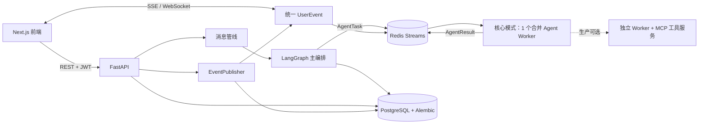

# haole-mas

`haole-mas` 是一个以群聊为交互入口的多 Agent 工作平台。项目以 `haole_03` 为唯一后端与编排主干，统一了 Next.js 前端、Skill 市场、Redis Agent 任务总线、MCP 工具、持久化用户事件、SSE 回放和短信 OTP 登录。

当前仓库默认支持 `LITELLM_MOCK=true` 的无密钥开发与测试模式；真实模型、短信、对象存储和发布服务需要在服务端配置对应凭据。

## 当前功能

- 短信验证码登录、JWT、刷新和一次性 OTP 消费。
- 主会话、普通群聊、单 Agent 私聊、`@Agent`、Plan/Ask/Auto 模式。
- 唯一 LangGraph 主编排器，按 `AgentTask`/`AgentResult` 契约通过 Redis Streams 调度四类 Worker。
- 文字、文档、图像、音视频 Agent；工具调用通过 MCP 服务边界完成。
- YAML Skill 校验、匹配、详情、安全元数据、安装、启用和停用。
- HITL、任务步骤、成果与 Agent 状态展示。
- 统一 `UserEvent`：PostgreSQL 持久化、Redis Pub/Sub、进程内 fallback、WebSocket 和 SSE 共用发布入口。
- Bearer SSE、心跳、稳定事件 ID、`Last-Event-ID` 回放、前端去重和断线重连。
- Next.js 15 正式前端、公开产品页、显式 mock 模式、生成式 OpenAPI TypeScript 类型。

## 架构



业务层只调用统一事件发布器，不分别维护 SSE 和 WebSocket 广播逻辑。前端不执行 Agent 编排，只负责 API 调用、状态展示、HITL 和实时事件消费。

## 目录

```text
backend/                    FastAPI、模型、服务、Alembic、Skill、测试
agents/agents/              主编排与四类 Agent Worker
agents/mcp_servers/         MCP 工具服务
frontend/                   Next.js 15 应用、Vitest、Playwright
backend/infrastructure/     PostgreSQL/Redis/MinIO/Qdrant/LiteLLM Compose
compose.core.yml            仅 PostgreSQL + Redis 的低成本核心设施
deploy/production/          可选云部署和完整设施说明
docs/migration/             迁移矩阵、基线和最终验证报告
openspec/                   本次整合的规格与验收任务
test/                       仓库级 Agent handler/live 测试
.github/workflows/          阻断式 CI 与安全检查
```

仓库只保留一个正式 `backend/`、一个正式 `agents/` 和一个正式 `frontend/`，没有并行的 Agno、旧 conductor 或第二套任务系统。

## 本地启动

要求：Python 3.12、uv 0.11.x、Node 20+、pnpm 9.15.9、Docker Compose。

```powershell
.\scripts\core.ps1 setup
.\scripts\core.ps1 start
.\scripts\core.ps1 status
```

The local core command explicitly enables a dev/test-only local guest session. Opening the frontend root URL enters the real workspace without SMS; the frontend still uses its normal JWT, FastAPI, PostgreSQL, Redis, and Agent paths. Production, staging, and ordinary development starts leave this disabled.

脚本会打印实际 URL，后端默认从 `8001` 开始查找空闲端口，前端默认从 `3000` 开始，不会停止不属于本项目的进程。详细说明见 [`GETTING_STARTED.md`](GETTING_STARTED.md)。

默认 `Procfile` 只启动后端、合并 Agent worker 和前端。四个独立 Worker、MCP、MinIO、Qdrant、LiteLLM 网关和 K8s 都属于可选生产配置，见 [`deploy/production/README.md`](deploy/production/README.md)。

### Mock 模式

根 `.env.example` 默认包含：

```dotenv
LITELLM_MOCK=true
SMS_DEV_MODE=true
```

开发 OTP 为 `123456`。前端 mock 只能显式开启：

```powershell
$env:NEXT_PUBLIC_MOCK_MODE='true'
pnpm dev
```

生产默认路径不会在 API 失败时静默退回 mock 数据。

### 真实服务模式

将 `LITELLM_MOCK=false`，配置 LiteLLM Proxy 及其服务端模型凭据。生产/预发布必须设置 `SMS_DEV_MODE=false`，并提供 `ALIYUN_ACCESS_KEY`、`ALIYUN_SECRET_KEY`、签名和模板；缺少任一项或误开通用开发验证码时，配置加载会直接失败。对象存储需要 OSS/MinIO 凭据。任何供应商密钥都不得使用 `NEXT_PUBLIC_*` 暴露到浏览器。

## 环境变量

完整模板见 `.env.example`。核心分组：

| 分组 | 变量 |
| --- | --- |
| 运行环境 | `ENV`、`DEBUG`、`LOG_LEVEL` |
| 数据 | `DATABASE_URL`、`REDIS_URL`、`CELERY_*` |
| 鉴权 | `JWT_SECRET`、`JWT_EXPIRE_HOURS`、`SMS_DEV_MODE`、`SMS_OTP_TTL_SECONDS`、`LOCAL_GUEST_ACCESS` |
| 实时事件 | `SSE_HEARTBEAT_SECONDS`、`WS_HEARTBEAT_SECONDS`、`CORS_ORIGINS` |
| 模型 | `LITELLM_URL`、`LITELLM_API_KEY`、`LITELLM_MOCK` |
| 工具 | `MCP_*_URL` |
| 对象存储 | `OSS_*` |
| 前端 | `NEXT_PUBLIC_API_URL`、`NEXT_PUBLIC_MOCK_MODE`、`NEXT_PUBLIC_LOCAL_GUEST_ACCESS` |

`JWT_SECRET`、`SMS_DEV_MODE=true` 和示例基础设施密码只能用于本地开发/测试；安全 CI 会阻止提交 `.env`、疑似真实密钥和高风险生产默认值。

## 数据库迁移

数据库结构只由 Alembic 管理，不在启动时调用 `create_all`。

```powershell
Push-Location backend
..\.venv\Scripts\alembic.exe history
..\.venv\Scripts\alembic.exe upgrade head
..\.venv\Scripts\alembic.exe current
..\.venv\Scripts\python.exe scripts/bootstrap-skills.py
Pop-Location
```

后端正常启动也会幂等同步 `backend/skills/playbooks/*.yaml`；CI 在空库 migration 后单独执行 bootstrap 并检查数据库行数，避免迁移成功但 Skill 市场为空。

本次整合新增：

- `20260721_0005_user_events.py`：持久化可回放用户事件。
- `20260721_0006_skill_lifecycle.py`：统一 Skill 安装/启停关系。

## API、事件与类型

- 消息历史：`GET /api/conversations/{id}/messages`
- 发送消息：`POST /api/conversations/{id}/messages`
- 实时事件：`GET /api/conversations/{id}/events`
- Skill：`GET /api/skills`、详情、`install`、`enable`、`disable`
- 登录：`POST /api/auth/sms/send`、`POST /api/auth/login`

SSE 请求使用 `Authorization: Bearer <jwt>`，重连时带 `Last-Event-ID`。后端 `EventType` 和 `UserEvent` 通过 OpenAPI 生成到 `frontend/lib/api-types.ts`；`backend/scripts/check-contracts.py` 会阻止手写事件联合类型或契约漂移。

更新 API 类型：

```powershell
Set-Location frontend
pnpm gen:api
```

## 测试与 CI

```powershell
.\.venv\Scripts\ruff.exe check backend agents
.\.venv\Scripts\python.exe -m compileall -q backend/app agents/agents agents/mcp_servers
.\.venv\Scripts\python.exe -m pytest backend/tests -q
.\.venv\Scripts\python.exe -m pytest agents/tests test/test_agent_task_handlers.py -q
.\.venv\Scripts\python.exe backend/scripts/check-contracts.py

Set-Location frontend
pnpm install --frozen-lockfile
pnpm lint
pnpm typecheck
pnpm test
pnpm build
pnpm test:e2e
```

`next dev` 与 `next build` 共用 `.next`。本地服务正在运行时，先执行 `scripts/core.ps1 stop`，完成生产构建后再重新 `start`，避免开发服务器继续引用已被构建过程替换的静态 chunk。

GitHub Actions 将后端、Agent、前端、跨语言契约和安全检查作为阻断式 job。真实模型 smoke test保持显式 opt-in，不是普通 PR 的强制条件。

## 已知限制

- 本地完整栈依赖可用的 Docker 守护进程；缺少 Docker 时仍可运行无外部依赖的单元/契约 E2E 和前端 mock 浏览器测试。
- 真实模型、阿里云短信、云 OSS 和外部发布渠道未包含公共测试凭据，必须单独验证。
- SSE 的 durable replay 依赖 PostgreSQL；Redis 不可用时只保证当前进程内订阅者的实时 fallback。
- `EventBus` 满队列会丢弃最旧事件；客户端应依赖持久化回放恢复短断线数据。
- Playwright 中真实短视频长链路仍为 opt-in/跳过；CI 的无密钥跨模块链路使用确定性 mock AgentResult。

## 迁移与许可证

- 迁移决策：`docs/migration/MIGRATION_MATRIX.md`
- 基线：`docs/migration/BASELINE_REPORT.md`
- 最终结果：`docs/migration/FINAL_VALIDATION_REPORT.md`
- 总结：`MIGRATION_REPORT.md`
- 第三方归属：`THIRD_PARTY_NOTICES.md`

四个来源仓库在审计提交中均未提供根许可证文件，因此本仓库没有替所有者擅自选择项目许可证。Hermes/Nous Research 派生代码继续保留文件头和 MIT 归属；贡献前请阅读 `CONTRIBUTING.md`。
